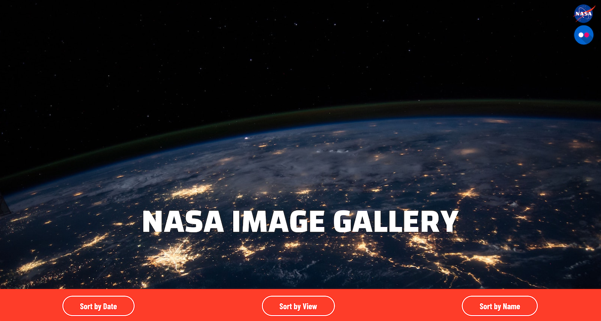

# Welcome to Nasa Image Gallery

[Live Demo](https://nasa-flickr-gallery.netlify.com/)

### Description

A flickr web-app that fetches images from Nasa's account via the Flickr API. Users can sort the result by date the photo taken, name of the photo as well as the number of views.

The app is fully responsive and can be used in all types of devices.

### Built with

* HTML5
* CSS3
* JavaScript
* React
* RESTful APIs
* VSCode

### Code & Design by
[Mehdi Pilehvarian](https://mehdipilehvarian.dev/)
